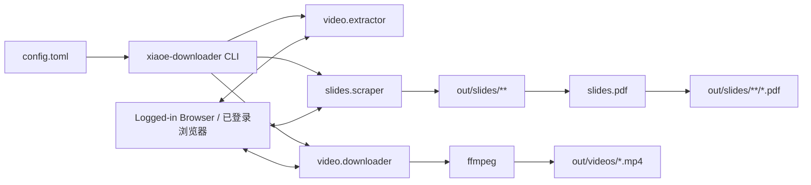

# xiaoe-downloader

[](LICENSE)
[](https://www.python.org/)
[](https://docs.astral.sh/uv/)
[](https://playwright.dev/python/)

小鹅通课程视频与介绍页课件资源下载工具。它复用浏览器登录态，读取课程目录，下载视频，并抓取视频详情页“介绍”tab 中可识别的课件图片资源。

Downloader for videos and intro-tab slide resources on xiaoe-tech course pages. It reuses an authenticated browser session, reads the course catalog, downloads videos, and captures supported slide images from each video detail page.

> 请仅用于你有权访问和备份的课程内容，并遵守课程平台和内容方的使用条款。
>
> Use this tool only for course content you are authorized to access and back up.

## Features / 功能

- 视频批量下载：提取课程目录，打开真实视频详情页，捕获 `.m3u8`，通过 `ffmpeg` 保存为 `.mp4`。
- 课件资源抓取：`slides` 命令进入视频详情页“介绍”tab，当前支持下载识别到的图片型课件资源。
- 课件 PDF 合并：可将已抓取的章节图片按 manifest 顺序合并为同级 PDF 文件。
- 浏览器登录态复用：通过 Chrome CDP 或 Playwright profile 复用你已经登录的小鹅通会话。
- 配置文件驱动：默认读取当前目录 `config.toml`，命令行参数可以覆盖配置。
- 标准 Python 包结构：核心代码按 `video/` 和 `slides/` 两个功能域分包。

## Contents / 目录

- [Requirements / 环境要求](#requirements--环境要求)
- [Installation / 安装](#installation--安装)
- [Quick Start / 快速开始](#quick-start--快速开始)
- [Commands / 命令](#commands--命令)
- [Configuration / 配置](#configuration--配置)
- [Output Layout / 输出结构](#output-layout--输出结构)
- [Architecture / 架构](#architecture--架构)
- [Development / 开发](#development--开发)
- [Troubleshooting / 排障](#troubleshooting--排障)
- [Contributing / 贡献](#contributing--贡献)
- [License / 许可证](#license--许可证)

## Requirements / 环境要求

| Tool | Requirement | Check |
|------|-------------|-------|
| uv | latest recommended | `uv --version` |
| Python | 3.10+ managed by uv | `uv run python --version` |
| Chrome / Edge | recent desktop browser | open normally |
| ffmpeg | available on `PATH` | `ffmpeg -version` |

Windows 用户可以用 `winget install ffmpeg` 安装 `ffmpeg`。macOS 用户可以用 Homebrew：`brew install ffmpeg`。

## Installation / 安装

```bash
git clone https://github.com/ysheba257-lgtm/xiaoe-downloader.git
cd xiaoe-downloader
uv sync
```

如果运行 `slides` 时 Playwright 提示缺少浏览器，可以安装 Chromium：

```bash
uv run playwright install chromium
```

## Quick Start / 快速开始

### 1. Start Chrome with remote debugging / 启动调试浏览器

`all`、`extract` 和 `download` 默认通过 Chrome DevTools Protocol 连接你已经打开并登录的浏览器。

```bash
# macOS
open -a "Google Chrome" --args --remote-debugging-port=9222

# Windows
chrome.exe --remote-debugging-port=9222

# Linux
google-chrome --remote-debugging-port=9222
```

Chrome 136+ 可能要求独立用户目录：

```bash
chrome.exe --remote-debugging-port=9222 --user-data-dir=C:\chrome-debug-profile
```

打开课程页并完成登录，确认页面能看到课程目录。

### 2. Configure defaults / 配置默认值

编辑当前目录的 `config.toml`，至少填入课程 URL。配置文件不存在时会使用内置默认值。

```toml
[extract]
course_url = "https://example.xetslk.com/s/xxxxx"
password = ""

[download]
output_dir = "./out/videos"

[slides]
course_url = "https://example.h5.xet.pomoho.com/p/course/ecourse/course_xxxxx"
output_dir = "./out/slides"

[slides.pdf]
enabled = false
```

### 3. Download videos / 下载视频

```bash
uv run xiaoe-downloader all
```

也可以直接在命令中传 URL 和输出目录：

```bash
uv run xiaoe-downloader all "https://example.xetslk.com/s/xxxxx" --out ./out/videos
```

### 4. Download slide resources / 下载介绍页课件资源

```bash
uv run xiaoe-downloader slides
```

登录态失效时打开可见浏览器重新登录：

```bash
uv run xiaoe-downloader slides --headed
```

需要抓取后自动合成 PDF 时：

```bash
uv run xiaoe-downloader slides --pdf
```

## Commands / 命令

| Command | Purpose |
|---------|---------|
| `extract [COURSE_URL]` | 读取课程目录，输出 `items.json`。 |
| `download [ITEMS_JSON]` | 从 `items.json` 打开每个视频详情页，捕获 `.m3u8` 并下载。 |
| `all [COURSE_URL]` | 执行 `extract` + `download`，适合直接下载整门课。 |
| `slides [COURSE_URL]` | 抓取视频详情页“介绍”tab 中的课件图片资源。 |
| `slides-pdf [SLIDES_ROOT]` | 从已有 slides 输出目录生成章节 PDF。 |

常用示例：

```bash
uv run xiaoe-downloader extract "https://example.xetslk.com/s/xxxxx" -o items.json
uv run xiaoe-downloader download items.json --out ./out/videos
uv run xiaoe-downloader all "https://example.xetslk.com/s/xxxxx" --out ./out/videos
uv run xiaoe-downloader slides "https://example.h5.xet.pomoho.com/p/course/ecourse/course_xxxxx" --out ./out/slides
uv run xiaoe-downloader slides-pdf ./out/slides
uv run python -m xiaoe_downloader --help
```

## Configuration / 配置

启动时自动读取当前目录 `config.toml`。优先级固定为：

```text
command line arguments > config.toml > built-in defaults
命令行参数 > config.toml > 内置默认值
```

最小配置示例：

```toml
[browser]
cdp_url = "http://localhost:9222"
profile = "/tmp/xiaoe-playwright-profile"
headed = false

[extract]
course_url = ""
password = ""
output_json = "items.json"
video_url_template = ""

[download]
items_json = "items.json"
output_dir = "./out/videos"
fallback_video_url_template = ""

[slides]
course_url = ""
output_dir = "./out/slides"
skip_title = "测试题"
clear = true
resource_concurrency = 6

[slides.pdf]
enabled = false
```

`slides --pdf` / `slides --no-pdf` 可以覆盖 `[slides.pdf] enabled`。`slides-pdf` 不重新抓取网页，只读取已有 `manifest.json` / `summary.json` 并补生成 PDF。

`video_url_template` 和 `fallback_video_url_template` 默认留空。工具会优先使用页面提供的真实 `video_url` / `jump_url`；只有旧页面无法提供详情页 URL 时，才建议显式配置模板。

敏感信息如课程密码不建议提交到公开仓库。

## Workflows / 工作流

### Video download workflow / 视频下载流程

1. 连接已登录的 Chrome。
2. 打开课程页，必要时输入课程密码。
3. 滚动加载完整目录并读取 Vue 数据。
4. 提取标题、资源 ID 和真实视频详情页 URL。
5. 打开每个详情页，监听 `.m3u8` 请求。
6. 调用 `ffmpeg` 保存为 `.mp4`。

### Slides workflow / 课件抓取流程

1. 使用 Playwright 持久化 profile 打开课程目录页。
2. 加载完整目录，跳过标题包含 `测试题` 的条目。
3. 进入每个视频详情页并点击“介绍”tab。
4. 滚动收集可识别的课件资源候选。
5. 当前版本下载图片型资源，按页面顺序保存为 `001.jpg`、`002.jpg`。
6. 写入每个条目的 `manifest.json` 和根级 `summary.json`。
7. 如果开启 PDF，按 manifest 顺序生成和章节目录同级的 PDF。

`slides-pdf` 可以对已有输出补生成 PDF：传入 `out/slides` 会处理其中所有课程，传入某个课程目录会处理该课程，传入单个章节目录则只处理该章节。

## Output Layout / 输出结构

```text
out/
├── videos/
│   ├── 01_第一课.mp4
│   └── 02_第二课.mp4
└── slides/
    └── 课程名/
        ├── 普通课程标题/
        │   ├── 001.jpg
        │   └── manifest.json
        ├── 普通课程标题.pdf
        ├── 章节标题/
        │   ├── 子小节标题/
        │   │   ├── 001.jpg
        │   │   └── manifest.json
        │   └── manifest.json
        ├── 章节标题.pdf
        └── summary.json
```

普通课程目录会合成一个同名 PDF。父章节目录只生成父章节 PDF，按子小节在章节 `manifest.json` 中的顺序串联图片，不额外生成子小节 PDF。

## Architecture / 架构



源码结构：

```text
src/xiaoe_downloader/
├── cli.py
├── config.py
├── video/
│   ├── extractor.py
│   ├── downloader.py
│   └── naming.py
└── slides/
    ├── browser.py
    ├── catalog.py
    ├── collector.py
    ├── downloads.py
    ├── manifest.py
    ├── models.py
    ├── naming.py
    ├── pdf.py
    └── scraper.py
```

`video/` 负责课程元数据提取与视频下载。`slides/` 负责课程目录加载、详情页“介绍”tab 资源收集、资源下载、manifest 写入和 PDF 合并。

## Development / 开发

```bash
uv sync
uv run pytest -q
uv run xiaoe-downloader --help
uv run xiaoe-downloader slides --help
uv run python -m xiaoe_downloader --help
```

项目使用 `src/` layout，包名为 `xiaoe_downloader`，对外 CLI 为 `xiaoe-downloader`。

## Troubleshooting / 排障

### `Connection refused`

Chrome 没有以远程调试模式运行，或端口不是 `9222`。重新按 Quick Start 启动 Chrome，或在 `[browser] cdp_url` 中配置实际端口。

### Login session expired / 登录态失效

先在调试 Chrome 中手动登录课程页。`slides` 命令可以加 `--headed` 打开可见 Playwright 浏览器并重新登录。

### No `.m3u8` captured / 找不到 m3u8

确认账号有权限播放该课程，并且视频详情页能够正常播放。部分站点可能不会在页面加载初期发出 `.m3u8`，可以适当调大 `download.page_wait_ms`。

### Only part of the catalog is loaded / 只抓到部分目录

课程页可能使用虚拟滚动或分页加载。调大 `extract.max_scrolls`、`extract.scroll_wait_ms`，或确认页面已经切到课程目录区域。

### `ffmpeg: command not found`

安装 `ffmpeg` 并确保它在 `PATH` 中，或在 `[ffmpeg] executable` 中配置可执行文件路径。

### Why are slides saved as `.jpg`? / 为什么 slides 当前保存为 `.jpg`？

`slides` 是面向课件资源的命令名；当前抓取阶段下载识别到的图片资源，因此使用连续编号的 `.jpg` 文件名。需要 PDF 时可开启 `[slides.pdf] enabled`、传 `slides --pdf`，或用 `slides-pdf` 对已有图片补生成。

## Contributing / 贡献

欢迎提交 issue 和 PR，尤其是：

- 适配更多小鹅通站点页面结构。
- 扩展 `slides` 支持 PPT、文档等课件资源。
- 改进大课程下载稳定性、断点续传和错误恢复。
- 补充测试用例和文档示例。

提交较大改动前，建议先开 issue 说明场景和方案。

## License / 许可证

MIT. See [LICENSE](LICENSE).
